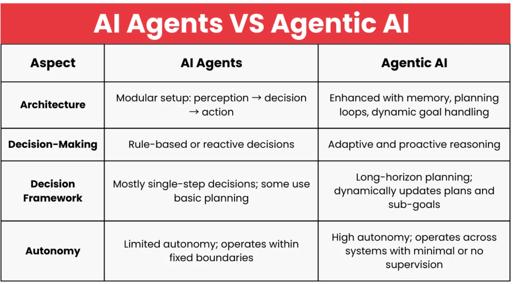

# Agentic AI - Examples
## Agents vs Agentic AI

Software constructs are created to perform functions such as Perception, Reasoning and Actions.  These can be categorized as AI Agents.  When these agents are deployed they are connected to tools and models providing artificial capabilities.  Large Language Models (LLMs)  involve LLM applications that can execute complex tasks through the use of an architecture that combines LLMs with key modules like planning and memory.
  
Agentic AI systems are autonomous AI systems that can perceive their environment, make decisions, plan, and take actions to achieve complex, pre-defined goals with minimal human intervention, moving beyond simple reactive responses to become proactive digital agents that learn, adapt, and orchestrate multi-step workflows using tools and collaboration.
  
### Design Patterns
<details>
  <summary>List here  </summary>

  <p>1. ReAct<p>2. Reasoning<p>3. Planning / Reflection<p>4. Tool Usage<p>5. Multi-Agent<p>6. Human in the Loop (HitL)<p>7. Workflow Orchestration<p>

</details>  

### Decision Making Frameworks
1. Rule-Based vs. Adaptive
Traditional AI agents often followed predefined decision rules or policies optimized for a clear objective. In contrast, an agentic AI approaches an adaptive way to make decisions. It can handle cases it wasn’t explicitly programmed for by reasoning through them. If an agentic AI controlling a smart home encounters an unknown situation (say, a new device joins the network), it could infer how to handle it (perhaps by reading the device’s manual via an internet lookup) rather than freezing or ignoring it – an adaptability beyond a fixed rule set.

2. Single-Step Decisions vs. Long-Horizon Planning
AI agents make decisions at each time step often myopically (what’s the best action now given my goal?). Some sophisticated agents plan ahead (like chess agents that simulate many moves ahead). Agentic AI plans for the long term. It keeps the ultimate goal in mind and plans a sequence of actions or conditional steps to get there, revising as needed. This aligns with human-like problem solving, where we break a big problem into smaller ones. <br><p> By embedding planning capability (using search algorithms or prompting an LLM to generate plans), agentic AI can tackle multi-step problems like “Find a good school for my child and help with the application process”, which involves a series of decisions over weeks or months. A classical agent might struggle with such an extended, multifaceted task.

3. Reactivity vs. Proactiveness
Many basic agents are reactive – they respond to events but do not take action unprovoked. An agentic AI is often proactive. If it notices an opportunity or a looming problem, it might act on its own initiative. For instance, an agentic AI managing your calendar could proactively move a meeting earlier if it sees a scheduling conflict, without you explicitly asking.  <br><p>That proactivity comes from treating certain optimizations or improvements as part of its goal model. Traditional agents, especially in business software, wouldn’t do that unless explicitly coded to. This difference in decision approach means agentic AI can appear more “initiative-taking” and thus useful in open-ended scenarios – but it also raises expectations that it should know when not to act, a balance that is an active area of development.

4. Transparency of Reasoning
With older agents, decision logic was often transparent (either via understandable rules or by tracing an algorithm). Agentic AI systems, especially those driven by deep learning and LLMs, can be more of a black box in their moment-to-moment reasoning.<br><p>Researchers are working on making their decision-making more interpretable. For example, some agentic frameworks have the AI “think out loud” (output its chain-of-thought reasoning) which helps developers follow what the agent is considering at each step. This is both a design and a usability consideration: an agentic AI might justify why it decided to, say, send an email on your behalf, whereas a classic agent might not explain why it flipped a switch because it was just following its programming.

## Agentic AI Examples
1. Automated Market Research Reporter - (key paths)

```
.
├─ main.py                      # FastAPI app (your file shown above)
├─ src/
│  ├─ planning_agent.py         # planner_agent(), executor_agent_step()
│  ├─ agents.py                 # research_agent, writer_agent, editor_agent  (example)
│  └─ research_tools.py         # tavily_search_tool, arxiv_search_tool, wikipedia_search_tool
├─ templates/
│  └─ index.html                # UI page rendered by "/"
├─ static/                      # optional static assets (css/js)
├─ docker/
│  └─ entrypoint.sh             # starts Postgres, prepares DB, then launches Uvicorn
├─ requirements.txt
├─ Dockerfile
└─ README.md
```
